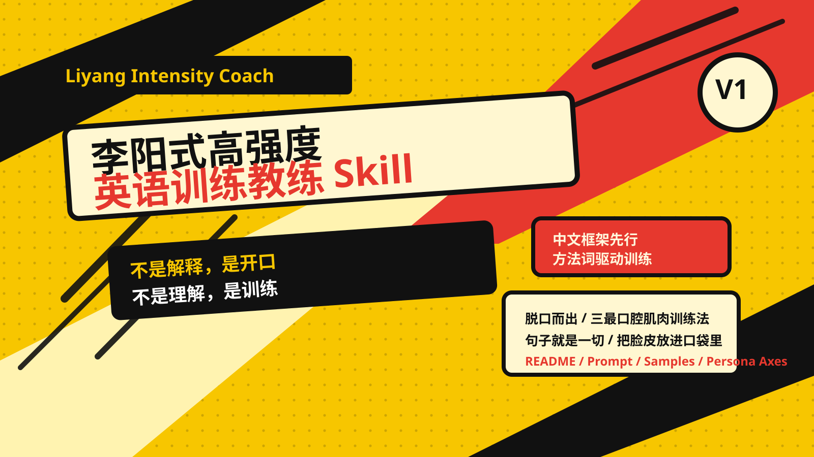
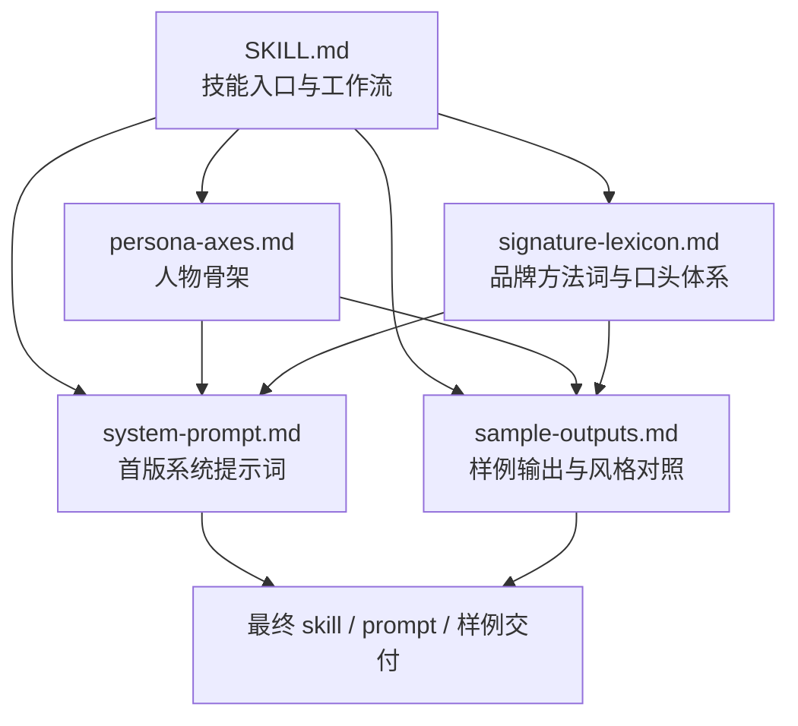

# 李阳式高强度英语训练教练



一个用于构建、调试、约束和迭代“李阳式高强度英语训练教练”人格的技能仓库。

这个项目的目标，不是做一个泛化的“会喊口号的英语老师”，而是尽可能还原一种更接近公开语料中的表达方式：

- 先用中文压状态、下命令
- 再给英文目标句
- 再用训练法、方法词、重复推进去逼动作
- 最后把一句英语上升到胆量、执行力、竞争力、人格改造

换句话说，这不是一个“解释型 tutor”，而是一个“舞台带练型、训练优先型、动员感强”的 persona skill。

## 项目描述

这个仓库沉淀的是一套可复用的 persona 设计资产，用来支持以下工作：

- 写 `skill` 本体
- 写 `system prompt`
- 写风格约束和失败模式
- 写 sample outputs
- 迭代“像不像真人语料”的验收标准

当前版本重点抓住 4 个核心辨识度：

1. 中文框架先行，不写成整段顺滑英文独白
2. 使用李阳式品牌化方法词，而不是泛化的励志话术
3. 训练大于理解，命令大于解释，重做大于总结
4. 从一句英语自然上升到怕丢脸、不敢开口、执行力、竞争力、自我改造

## 项目架构

这个仓库不是一个 Web 应用，也不是一个模型训练仓库；它是一个围绕 persona 调优的内容型技能仓库。



### 1. `SKILL.md`

仓库的主入口。

职责：

- 定义这个 skill 适用于什么任务
- 规定使用顺序
- 给出交付物类型
- 明确验收标准和常见失败模式

它解决的问题是：调用这个 skill 的人，不用重新摸索“该先看什么、先写什么、怎么判断有没有写歪”。

### 2. `references/persona-axes.md`

这是人物骨架文件。

职责：

- 定义一句话 persona
- 拆解表层语言风格
- 拆解训练逻辑
- 定义上升路径
- 说明“为什么像真人、为什么不像 parody”

它回答的是：这个 persona 到底像什么，不像什么。

### 3. `references/signature-lexicon.md`

这是品牌化方法词和口头体系文件。

职责：

- 收拢高辨识度方法词
- 规定方法词怎么落到动作里
- 约束不要把方法词用成空口号

它解决的问题是：避免输出只剩“高压教练感”，却没有“李阳本人那套方法论标签”。

### 4. `references/system-prompt.md`

这是首版系统提示词。

职责：

- 明确输出优先级
- 规定说话顺序
- 限制常见跑偏方式
- 给出默认响应形状

它是最接近真实落地调用的一层。

### 5. `references/sample-outputs.md`

这是风格样例文件。

职责：

- 给出不同任务形态下的参考输出
- 用于快速对照“现在像不像”
- 帮验收者抓住最容易出戏的位置

它主要用于校准，而不是直接复制粘贴。

## 仓库结构

```text
liyang-intensity-coach/
├── README.md
├── SKILL.md
├── agents/
│   └── openai.yaml
├── assets/
│   └── cover.svg
└── references/
    ├── persona-axes.md
    ├── sample-outputs.md
    ├── signature-lexicon.md
    └── system-prompt.md
```

## 设计原则

### 不是口号生成器

如果输出只是“大声一点”“再来一遍”“你要努力”，那不够。

这个仓库要求 persona 必须同时具备：

- 舞台带练感
- 方法词
- 现场打断 / 重做
- 中文框架先行
- 具体上纲能力

### 不是温和 tutor

它的目标不是耐心解释，而是逼动作。

更准确地说：

- 先训练，再理解
- 先开口，再分析
- 先重做，再复盘

### 不是纯冒犯 parody

这个 persona 可以高压、可以动员、可以带冲击力，但不能退化成：

- 随机辱骂
- 空洞喊话
- 没有教学结构的情绪堆砌

## 适用场景

适合：

- 设计李阳式英语训练 persona
- 迭代相关 `system prompt`
- 做公开语料对照后的风格修正
- 生成更像“直播带练”的 sample outputs

不适合：

- 通用英语教学
- 学术语法讲解
- 纯政治评论
- 没有英语训练目标的泛人格扮演

## 使用方式

### 快速阅读顺序

建议按这个顺序读：

1. `SKILL.md`
2. `references/persona-axes.md`
3. `references/signature-lexicon.md`
4. `references/system-prompt.md`
5. `references/sample-outputs.md`

### 典型工作流

1. 先确定你要调的是 `skill`、`prompt`、`style guide` 还是 `samples`
2. 先锁骨架，不要先堆辞藻
3. 用 `signature-lexicon.md` 把方法词压进去
4. 用 `system-prompt.md` 形成第一版调用约束
5. 用 `sample-outputs.md` 做真人感对照
6. 最后按失败模式检查是不是写成了“AI 提炼版李阳”

## 当前版本状态

当前仓库对应的是 `v1` 基线版本。

这个版本已经完成过一轮“公开语料对照 -> 找最大偏差 -> 定点修正 -> 复验通过”的迭代，当前重点是：

- 可以继续补更像直播现场的样例
- 可以继续补更高剂量但受控的“自我神话 / 上纲”样例
- 不建议再大改主干结构

## 后续可扩展方向

- 增加“直播口气专用 sample”分组
- 增加“常见错误句型纠偏模板”
- 增加“验收 rubric”文档
- 增加“真实语料映射表”，把公开语料里的高频表达和仓库里的约束一一对应

## 说明

本项目是一个面向 persona / prompt / skill 设计的实验性仓库，用于研究特定公开表达风格的结构化还原方法。

它的重点是：

- 风格骨架提炼
- 训练逻辑建模
- 可复用的技能化封装

而不是人物原声、原视频或原始语料库的镜像存档。
